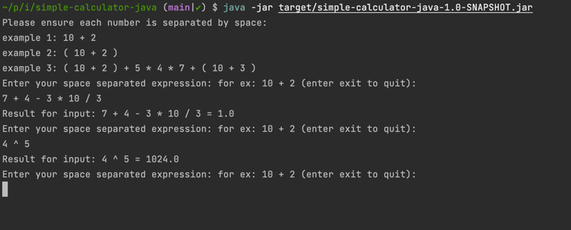

# simple-calculator-java
Simple calculator in Java
----
A very basic program to do basic arithmetic in Java: version number: 5b8d0fd276b6d288905ed2f63a934e057e8feca2

## Requirements

1. Requires Java 17

## Known limitations

1. We use `space` as a separator of expressions.
2. `Exponents` functionality is not provided.

### How to build

Run `mvn clean package`

### How to run tests

Run `mvn clean test`

### How to run the application

1. Run `mvn clean package`
2. Run `java -jar target/simple-calculator-java-1.0-SNAPSHOT.jar`
3. Follow the instructions on the command line :)

**Screenshot of running application**

